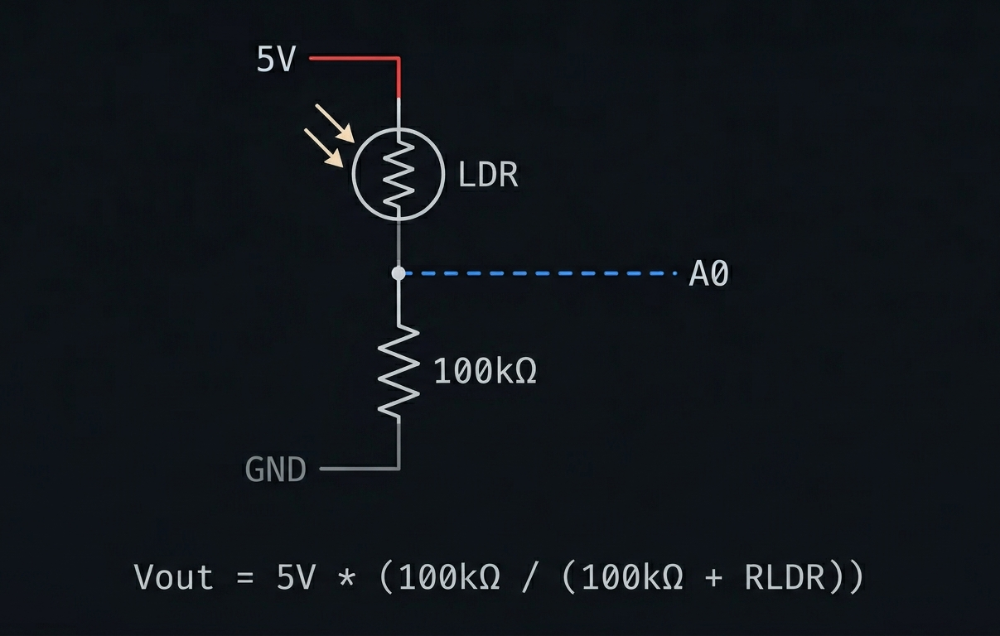

# Monitor LDR con Arduino y Socket.io

Divisor de voltaje con fotorresistencia (LDR) leído por Arduino Uno,
visualizado en tiempo real desde el navegador con Node.js y Socket.io.

## Requisitos
- Arduino Uno
- Node.js

## Circuito

## Uso
1. Cargar el `.ino` en el Arduino
2. Entrar a la carpeta `proyecto-ldr`
3. Correr `npm install`
4. Correr `node server.js`
5. Abrir `http://localhost:3000`
